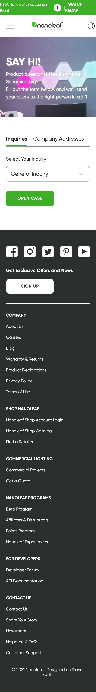

# Procesverslag
Markdown is een simpele manier om HTML te schrijven.  
Markdown cheat cheet: [Hulp bij het schrijven van Markdown](https://github.com/adam-p/markdown-here/wiki/Markdown-Cheatsheet).

Nb. De standaardstructuur en de spartaanse opmaak van de README.md zijn helemaal prima. Het gaat om de inhoud van je procesverslag. Besteedt de tijd voor pracht en praal aan je website.

Nb. Door *open* toe te voegen aan een *details* element kun je deze standaard open zetten. Fijn om dat steeds voor de relevante stuk(ken) te doen.

## Jij

uitwerken voor kick-off werkgroep

### Auteur:
Sidney Rosman

#### Je startniveau:
Blauw

#### Je focus:
Responsive 
 

## Je website

uitwerken voor kick-off werkgroep

### Je opdracht:
https://nanoleaf.me/en-EU/

#### Screenshot(s) van de eerste pagina (small screen): 
1e pagina 

#### Screenshot(s) van de tweede pagina (small screen):
2e pagina  

 

## Breakdownschets (week 1)

uitwerken na afloop 2e werkgroep

### de hele pagina: 

### dynamisch deel (bijv menu): 

## Voortgang 1 (week 2)

uitwerken voor 1e voortgang

### Stand van zaken
In deze week was ik begonnen met het coderen van de website. Het was wel even lastig om alle stof
van vorig jaar terug te halen en te bedenken hoe het allemaal ook al weer moest. Samen met de opdrachten 
die we kregen kwam alles langzaam weer naar boven. Snel ging ik proberen om de website na te maken. Al snel kwam
bij mijn eerste probleem en dat was de achtergrond plaatje. Het duurde even voordat ik dat door had, gelukkig kwam het goed.
Nu kon ik verder met de ander sections van mijn website.

### Agenda voor meeting
samen met je groepje opstellen

| Martha         | Vera               | Sidney       | student 4        |
| ---            | ---                | ---          | ---              |
| Positioneren   | Positioneren       | Positioneren |                  |
|                |                    |              |                  |
| ...            | ...                | ...          | ...              |

### Verslag van meeting
hier na afloop snel de uitkomsten van de meeting vastleggen

- In deze meeting is er verteld hoe we bepaalde objecten moeten positioneren. Wij 
allemaal vonden dat nog een beetje lastig en ik zelf had het nodig voor mijn eerst
section van mijn website dus ik vond het handig om dat te vragen

## Voortgang 2 (week 3)

uitwerken voor 2e voortgang

### Stand van zaken
Bij deze week had ik al veer meer elementen van de website die ik aan het namaken was.
Het begon al goed from te geven. Ik had nog niet met @media gewerkt dus de website zag
er nog niet goed uit als ik het beeld vergrote. Ook had ik nog niets kwa code voor
mijn 2e pagina. Maar ik wist dat die niet zo moeilijk zou zijn met het stylen als
de 1e pagina.

### Agenda voor meeting
samen met je groepje opstellen

| Martha         | Vera               | Sidney       | student 4        |
| ---            | ---                | ---          | ---              |
|                | Was er niet        | @media       |                  |
|                |                    |              |                  |
| ...            | ...                | ...          | ...              |

### Verslag van meeting
hier na afloop snel de uitkomsten van de meeting vastleggen

- Caroline heeft mij meer uitleg gegeven over @media hierdoor kon ik de website responsive
gaan maken. Eerst was het wat ingewikkeld om dat te doen samen met grid maar als snel kreeg 
ik er gevoel voor.

## Toegankelijkheidstest (week 4)

uitwerken na test in 8e voortgang

### Bevindingen
Lijst met je bevindingen die in de test naar voren kwamen:

#### Mensen met slecht zicht
- Nadelen kunnen zijn dat ze minder goed focus kunnen leggen op belangrijke content.
- Dat de text te klein is en dus onduidelijk te lezen is.
- Mensen die een tunnel visie hebben kunnen maar een heel klein deel van de website bekijken.

---Oplossing---
- Dit kan opgelost worden door de text dikker te maken. Natuurlijk zal dit niet voor iedereen
beter werken maar voor somigen zou ze dan de belangrijke content beter zien

#### Screen Reader 
- Door VoiceOver te activeren kunnen zij begrijpen wat voor content er op de website staat. Bij 
mijn website staat alles wel op de goeie volgorder waardoor mensen alleen staan de plaatjes voor 
de kopjes waardoor de blinden mensen niet weten waar het plaatje over gaan.

---Oplossing---
- Door de plaatjes onder de kopjes te zetten en doormiddel van "order: -1;" de plaatjes terug zetten 
op de juiste plek. (Inmiddels toegevoegd)

#### Muis en toetsenbord
- Het doorlopen van de webstite met de tap-button verloopt goed.
- Er zijn nog geen hover States waardoor het mis een beetje onduidelijk is waar je bent of waar je op kan drukken.

---Oplossing---
- Door Hover states toe te voegen weet de gebruiker nog beter waar hij is in de website
als hij boven een knop zit. (inmiddels toegevoegd)

#### Titel nog een bevinding. 
Hier korte omschrijving (met indien nodig een afbeelding)

Hier een omschrijving van hoe het opgelost kan worden (met indien nodig een afbeelding)

## Voortgang 3 (week 4)

uitwerken voor 3e voortgang

### Stand van zaken
Deze week niet heel veel aan de website kunnen werken. Vormgeving deadline kwam er ook aan 
en ik had zelf al het gevoel dat ik het niet af zou hebben dus ik heb deze week meer gefocused
op vormgeving.

### Agenda voor meeting
samen met je groepje opstellen

| Martha         | Vera               | Sidney       | student 4        |
| ---            | ---                | ---          | ---              |
| js hamburger   | js hamburger       | js hamburger |                  |
|                |                    |              |                  |
| ...            | ...                | ...          | ...              |

### Verslag van meeting
hier na afloop snel de uitkomsten van de meeting vastleggen

- Wij wilde allemaal extra uitleg over de hamburger menu met java skript. Wij hadden
allemaal ongeveer de zelfde hamburger menu in onze websites dus ons leek het handig om daar
meer infromatie over te vragen. Ik vond het nog steeds erg moeilijk om te begrijpen hoe het 
precies werkt met js omdat ik het vak vorig jaar over js heb gemist. 

## Eindgesprek (week 5)

uitwerken voor eindgesprek

### Stand van zaken
Helaas was het niet helemaal goed gegaan met het inleveren van mijn zip bestand waardoor ik niet op gesprek kon komen. 
Toch daarna ben ik hard aan het werk gegaan om mijn website te verbeteren en te laten werken. Na een lange tijd
heel veel oefen en proberen is het me gelukt om de website af te krijgen.

### Screenshot(s)

## Reflectie
Natuulijk ging het niet perfect de doorloop van het maken en coderen van deze website. Als ik had geweten dat het 
zo veel tijd zou kosten had ik waarscheinlijk voor een ander website gekozen. Toch ben ik erg trots op hoever
ik ben gekomen. Ik heb veel hulp gehad van de studenten asistent Carolin, zij heeft met veel uit de brand geholpen.

## Verbeteringen
Er zijn ook een aantal dingen die verbeterd konden worden aan mijn site. Het genen waar ik de meeste struggles mee 
had was het eerste plaatje van de tweede section als de minimale groote van het scherm groter was dan 767px. Het 
plaatje neemt niet de hele ruime van de li in waar hij in is geplaats waardoor het op bepaalde grotes er een beetje gek 
uit ziet. Ook met Carolin haar krachten lukten het ons niet om er op te komen om dat probleem op te lossen.

## Bronnenlijst

continu bijhouden terwijl je werkt

1. https://dlo.mijnhva.nl/d2l/le/content/324287/Home de oefeningen en de precentaties 
2. https://www.youtube.com/watch?v=_lEkD8IGkwo
3. https://www.youtube.com/watch?v=yU7jJ3NbPdA
4. https://www.youtube.com/watch?v=JJSoEo8JSnc
5. https://www.w3schools.com/css/css_border.asp

